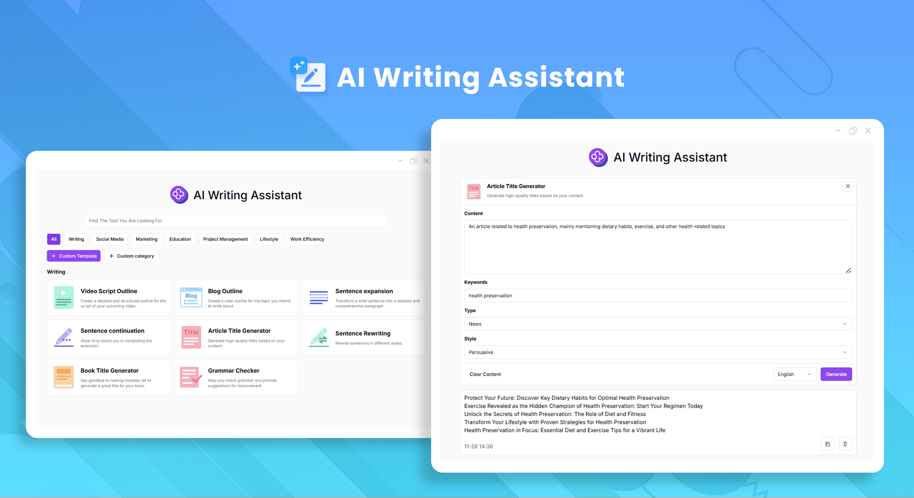
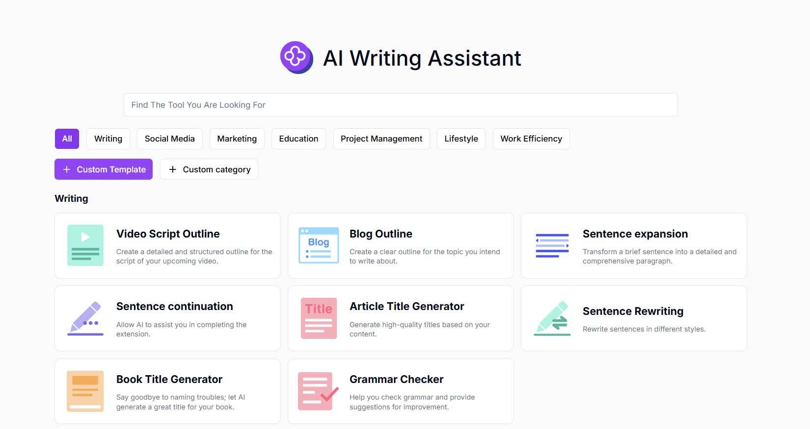
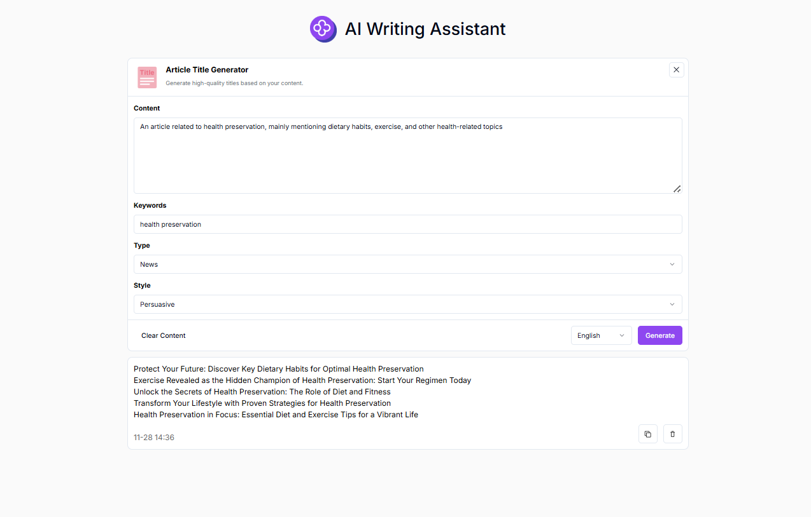

 # 
✒️ AI Copywriting Assistant 🚀✨

The AI copywriting assistant can quickly generate high-quality creative content, optimize existing copywriting, and customize personalized content according to different scenarios and target audiences.

<a href="README_zh.md">中文</a> | <a href="README.md">English</a> | <a href="README_ja.md">日本語</a>

   

This is the open-source version of [AI Copywriting Assistant](https://302.ai/product/detail/31) from [302.AI](https://302.ai/en/).
You can directly log in to 302.AI to use the online version with zero code and zero configuration.
Or modify this project according to your needs, input 302.AI's API KEY, and deploy it yourself.

## Interface Preview
Multiple scene types and copywriting writing methods have been launched for you to choose from. It also provides a custom copywriting production function to help you quickly generate high-quality copywriting.
      

Taking article title generation as an example, input the content and keywords, select the type and style, and then high-quality titles can be generated according to your content.

## Project Features
### 🛠️ Copywriting for Multiple Scenarios
Currently, seven scenario types have been launched, and the custom copywriting production function is provided to meet different needs.
- Content Creation
- Social Media
- Marketing
- Education
- Project Management
- Lifestyle
- Work Efficiency
### ✏️ Multiple Copywriting Methods
Article title generation, SEO title generation, SEO description generation, content summary, Twitter post generation, Facebook post generation, Instagram post generation, Xiaohongshu post generation, Weibo post generation, Threads post generation, Q&A generation, sentence continuation, sentence expansion, one-week fitness plan, social network Bio generation, email generation, email reply generation, comment generation, comment reply generation, daily report generation, weekly report generation, monthly report generation, quick response, video script outline, video description, "About Us" generator, meeting summary, text shortening, personal introduction generation, interview Q&A generation, dinner plan, career development plan, naming of game characters, blog outline, one-week diet plan, conversion of text into tables, long-tail keyword generation, video title generation, book title generation, grammar check, professional explanation, sentence rewriting, tone analysis, task breakdown, article title generation.
### 🌍 Multi-language Generation
It supports the generation of copywriting in multiple languages, including but not limited to Chinese, English, Japanese, etc., helping users easily meet the content creation needs of the global market.
### 🌐 Full Internationalization
- Chinese Interface
- English Interface
- Japanese Interface

With the AI Copywriting Assistant, you can quickly generate high-quality creative content, optimize existing copy, and customize content based on different scenarios and target audiences. 🎉💻 Let's explore the new world of AI-driven code together! 🌟🚀

## 🚩 Future Update Plans 
- [ ] Optimize the algorithm to enhance originality
- [ ] Develop a real-time collaboration mode that allows multiple users to edit, modify and discuss the copywriting simultaneously, facilitating teamwork in creating copywriting

## Tech Stack
- Next.js 14
- Tailwind CSS
- Shadcn UI

## Development & Deployment
1. Clone project `git clone https://github.com/302ai/302_copywriting_assistant`
2. Install dependencies `pnpm install`
3. Configure 302's API KEY (refer to .env.example)
4. Run project `pnpm dev`
5. Build and deploy `docker build -t coder-generator . && docker run -p 3000:3000 coder-generator`

## ✨ About 302.AI ✨
[302.AI](https://302.ai) is an enterprise-oriented AI application platform that offers pay-as-you-go services, ready-to-use solutions, and an open-source ecosystem.✨
1. 🧠 Combines the latest and most comprehensive AI capabilities and brands, including but not limited to language models, image models, voice models, and video models.
2. 🚀 Deep application development on basic models - we develop real AI products, not just simple chatbots
3. 💰 Zero monthly fees, all features are pay-per-use, fully open, achieving truly low barriers with high potential.
4. 🛠 Powerful management backend for teams and SMEs - one person manages, multiple people use.
5. 🔗 All AI capabilities provide API access, all tools are open source and customizable (in progress).
6. 💡 Strong development team, launching 2-3 new applications weekly, daily product updates. Developers interested in joining are welcome to contact us
