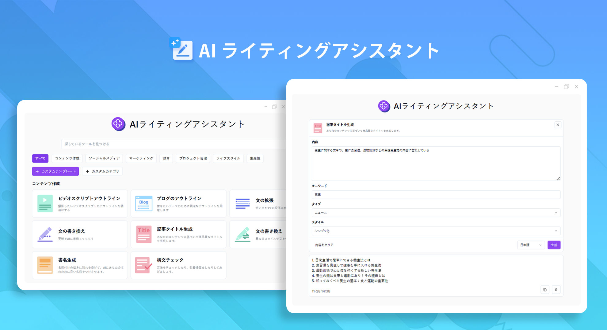
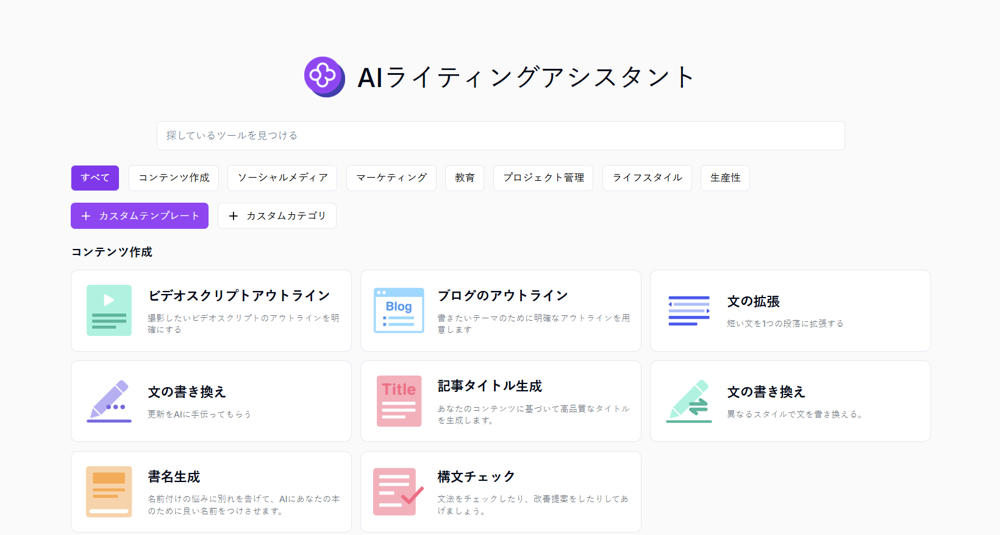
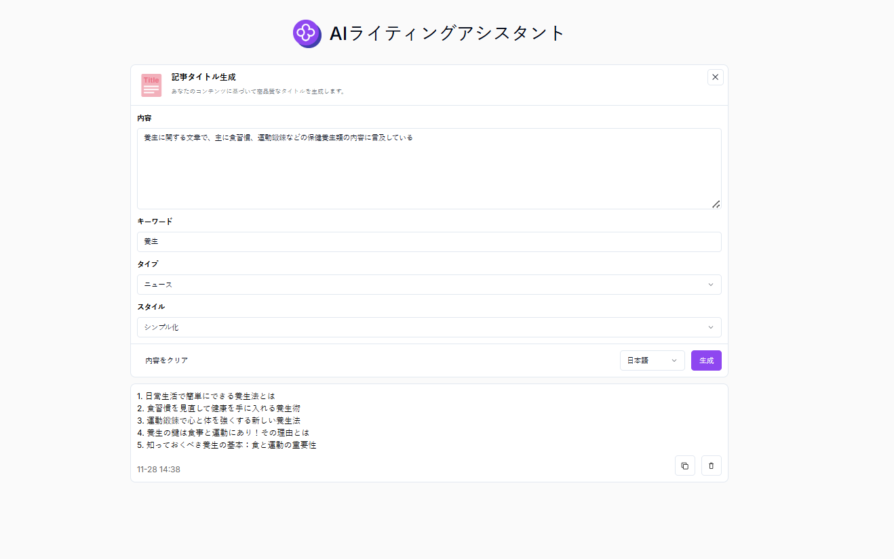

# 
✒️ AI コピーライティングアシスタント 🚀✨

AI コピーライティングアシスタントは、高品質なクリエイティブなコンテンツを迅速に生成し、既存のコピーライティングを最適化し、さまざまなシーンやターゲットオーディエンスに応じて個性化されたコンテンツをカスタマイズすることができます。

<a href="README_zh.md">中文</a> | <a href="README.md">English</a> | <a href="README_ja.md">日本語</a>

  

[302.AI](https://302.ai/ja/)の[AIコピーライティングアシスタント](https://302.ai/product/detail/31)のオープンソース版です。
302.AIに直接ログインしてコード不要・設定不要のオンライン版を使用するか、
本プロジェクトを自身のニーズに合わせて修正し、302.AIのAPI KEYを使用して独自にデプロイすることができます。

## インターフェースプレビュー
複数のシーンタイプと文案作成方法がオンラインに上がり、選択できるようになりました。カスタム文案作成機能も提供しており、あなたが迅速に高品質な文案を生成するのを助けます。
      

記事のタイトル生成を例にとると、内容とキーワードを入力し、タイプとスタイルを選択すると、あなたの内容に応じた高品質のタイトルを生成することができます。

## プロジェクトの特徴
### 🛠️ 複数のシーン向けのコピーライティング
現在、7 つのシーンタイプがローンチされており、カスタムコピーライティング作成機能が提供されて、さまざまなニーズに対応しています。
- コンテンツ作成
- ソーシャルメディア
- マーケティング
- 教育
- プロジェクト管理
- ライフスタイル
- 作業効率
### ✏️ 複数のコピーライティングの書き方
記事タイトル生成、SEO タイトル生成、SEO 説明生成、コンテンツ要約、ツイッター投稿生成、フェイスブック投稿生成、インスタグラム投稿生成、小红书投稿生成、微博投稿生成、Threads 投稿生成、Q&A 生成、文の続きを書く、文を拡張する、1 週間のフィットネスプラン、ソーシャルネットワークの自己紹介文生成、メール生成、メール返信生成、コメント生成、コメント返信生成、日報生成、週報生成、月報生成、迅速な回答、ビデオスクリプトの概要、ビデオ説明、「当社について」生成器、会議の要約、テキストの短縮、自己紹介文生成、面接の質問と回答生成、夕食プラン、キャリア開発計画、ゲームキャラクターの名前付け、ブログの概要、1 週間の食事計画、テキストを表に変換する、ロングテールキーワード生成、ビデオタイトル生成、書名生成、文法チェック、専門的な説明、文の書き換え、トーン分析、タスクの分解、記事タイトル生成。
### 🌍 多言語生成
複数の言語でのコピーライティング生成をサポートしており、中国語、英語、日本語などを含むがこれらに限定されない多くの言語が対象で、ユーザーが世界市場のコンテンツ作成ニーズに対応するのを簡単に支援しています。
### 🌐 完全な国際化
- 中国語インターフェース
- 英語インターフェース
- 日本語インターフェース

AIコピーライティングアシスタントを使用することで、高品質なクリエイティブコンテンツを素早く生成し、既存の文章を最適化し、異なるシーンとターゲット層に合わせてパーソナライズされたコンテンツを作成できます。 🎉💻 AIが切り開く新しいコードの世界を一緒に探検しましょう！ 🌟🚀

## 🚩 将来のアップデート計画
- [ ] アルゴリズムを最適化し、オリジナリティを強化する
- [ ] 複数のユーザーが同時にコピーライティングを編集、修正、討論できるリアルタイム協働モードを開発し、チームでのコピーライティング作成を便利にする

## 技術スタック
- Next.js 14
- Tailwind CSS
- Shadcn UI

## 開発とデプロイ
1. プロジェクトのクローン：`git clone https://github.com/302ai/302_copywriting_assistant`
2. 依存関係のインストール：`pnpm install`
3. 302のAPI KEYの設定：.env.exampleを参照
4. プロジェクトの実行：`pnpm dev`
5. ビルドとデプロイ：`docker build -t coder-generator . && docker run -p 3000:3000 coder-generator`

## ✨ 302.AIについて ✨
[302.AI](https://302.ai)は企業向けのAIアプリケーションプラットフォームであり、必要に応じて支払い、すぐに使用できるオープンソースのエコシステムです。✨
1. 🧠 言語モデル、画像モデル、音声モデル、動画モデルなど、最新かつ包括的なAI機能とブランドを統合
2. 🚀 基本モデルの上に高度なアプリケーション開発を行い、単なるチャットボットではなく、真のAI製品を開発
3. 💰 月額料金なし、すべての機能を従量課金制で提供し、参入障壁を低く、上限を高く設定
4. 🛠 チームや中小企業向けの強力な管理バックエンド、1人で管理し、多人数で利用可能
5. 🔗 すべてのAI機能にAPIアクセスを提供し、すべてのツールをオープンソース化してカスタマイズ可能（進行中）
6. 💡 週2-3個の新アプリケーションをリリースし、製品を毎日更新する強力な開発チーム。開発者の参加も歓迎
