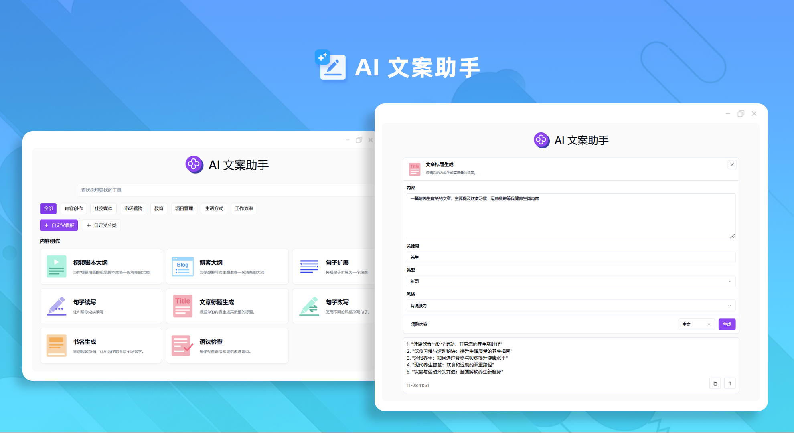
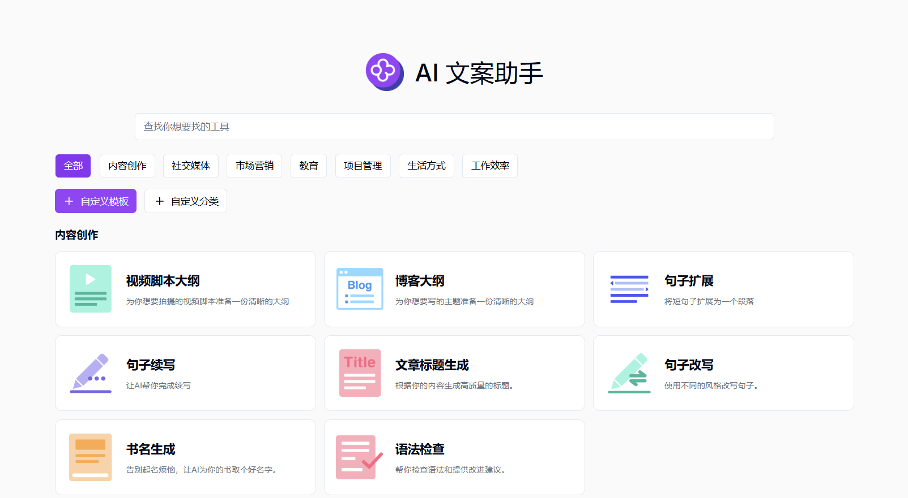
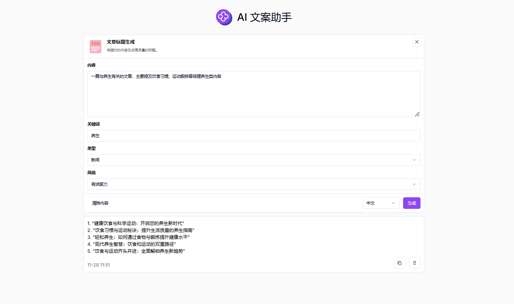

# 
 ✒️  AI 文案助手 🚀✨

AI文案助手可以快速生成高质量的创意内容、优化现有文案、并根据不同场景和目标受众定制个性化内容。

<a href="README_zh.md">中文</a> | <a href="README.md">English</a> | <a href="README_ja.md">日本語</a>

  

来自[302.AI](https://302.ai)的[AI 文案助手](https://302.ai/product/detail/31)的开源版本。你可以直接登录302.AI，零代码零配置使用在线版本。或者对本项目根据自己的需求进行修改，传入302.AI的API KEY，自行部署。

## 界面预览
已上线多种场景类型和文案编写方式可供选择，提供自定义文案制作功能，帮助您快速生成高质量的文案。
      

以文章标题生成为例，输入内容和关键词，选择类型和风格，即可根据您的内容生成高质量的标题。

## 项目特性
### 🛠️ 多场景文案编写 
目前已上线七种场景类型，提供自定义文案制作功能，满足不同需求。
  - 内容创作
  - 社交媒体
  - 市场营销
  - 教育
  - 项目管理
  - 生活方式
  - 工作效率

### ✏️ 多种文案编写方式
文章标题生成、SEO标题生成、seo描述生成、内容摘要、推特帖子生成、Facebook帖子生成、Instagram帖子生成、小红书帖子生成、微博帖子生成、Threads帖子生成、Q&A生成、句子续写、句子扩展、一周健身计划、社交网络Bio生成、邮件生成、邮件回复生成、评论生成、评论回复生成、日报生成、周报生成、月报生成、快速回答、视频脚本大纲、视频描述、关于我们生成器、会议总结、文本缩短、个人介绍生成、面试问答生成、晚餐计划、职业发展规划、游戏人物起名、博客大纲、一周饮食计划、文字转换为表格、长尾关键词生成、视频标题生成、书名生成、语法检查、专业解释、句子改写、语气分析、任务拆解、文章标题生成。

### 🌍 多语言生成 
  支持多种语言的文案生成，包括但不限于中文、英文、日文等，帮助用户轻松应对全球市场的内容创作需求。
  
### 🌐 全面国际化 
  - 中文界面
  - English Interface
  - 日本語インターフェース

通过AI 文案助手,可以快速生成高质量的创意内容、优化现有文案、并根据不同场景和目标受众定制个性化内容。 🎉💻 让我们一起探索AI驱动的代码新世界吧! 🌟🚀

## 🚩 未来更新计划
- [ ] 优化算法，增强原创性
- [ ] 开发实时协作模式，允许多个用户同时对文案进行编辑、修改和讨论，方便团队合作创作文案
  
## 技术栈
- Next.js 14
- Tailwind CSS
- Shadcn UI

## 开发&部署
1. 克隆项目 `git clone https://github.com/302ai/302_copywriting_assistant`
2. 安装依赖 `pnpm install`
3. 配置302的API KEY 参考.env.example
4. 运行项目 `pnpm dev`
5. 打包部署 `docker build -t coder-generator . && docker run -p 3000:3000 coder-generator`

## ✨ 302.AI介绍 ✨
[302.AI](https://302.ai)是一个面向企业的AI应用平台，按需付费，开箱即用，开源生态。✨
1. 🧠 集合了最新最全的AI能力和品牌，包括但不限于语言模型、图像模型、声音模型、视频模型。
2. 🚀 在基础模型上进行深度应用开发，我们开发真正的AI产品，而不是简单的对话机器人
3. 💰 零月费，所有功能按需付费，全面开放，做到真正的门槛低，上限高。
4. 🛠 功能强大的管理后台，面向团队和中小企业，一人管理，多人使用。
5. 🔗 所有AI能力均提供API接入，所有工具开源可自行定制（进行中）。
6. 💡 强大的开发团队，每周推出2-3个新应用，产品每日更新。有兴趣加入的开发者也欢迎联系我们
